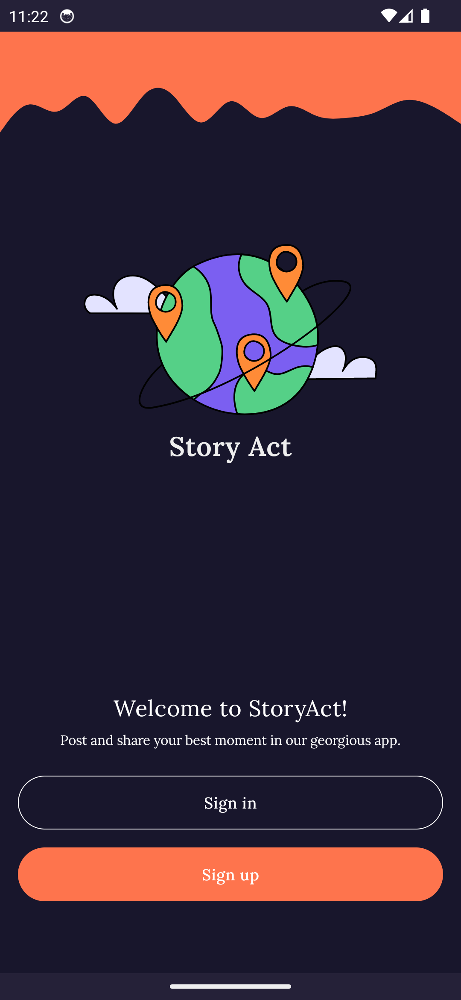
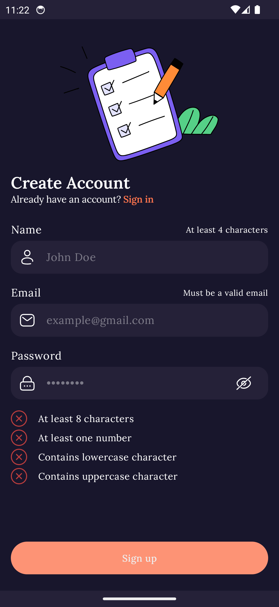
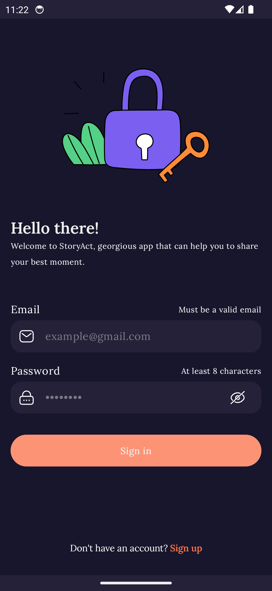
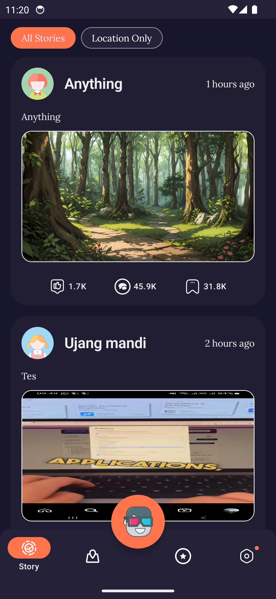
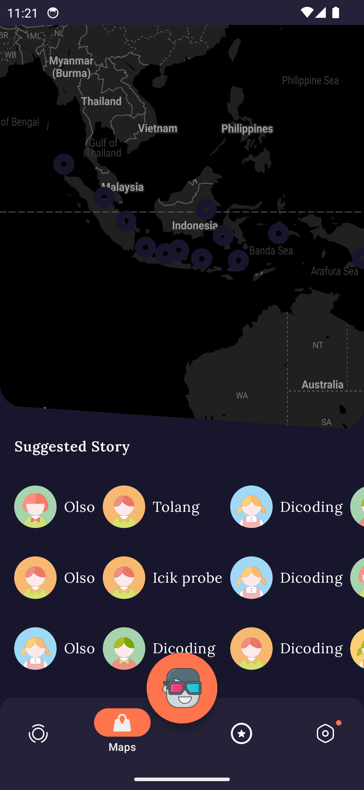
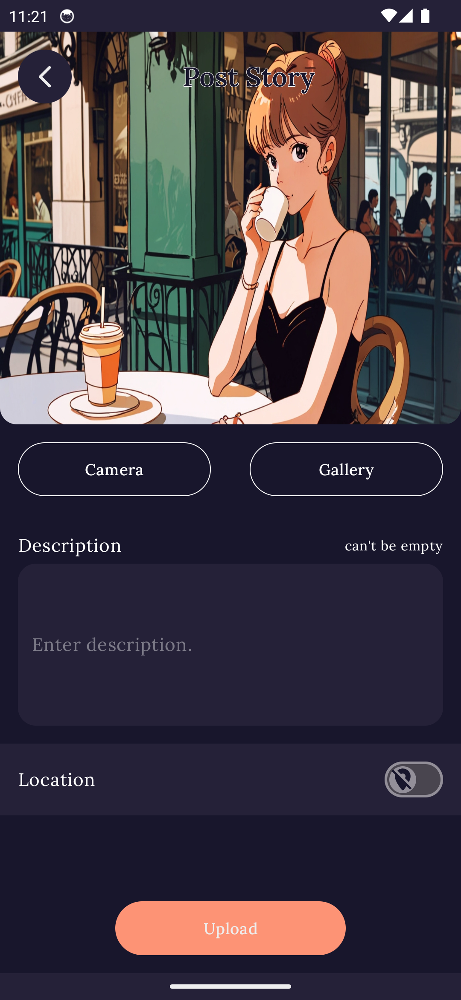
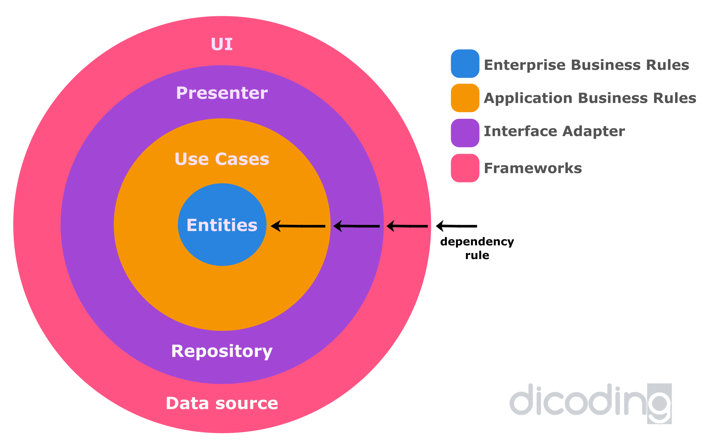
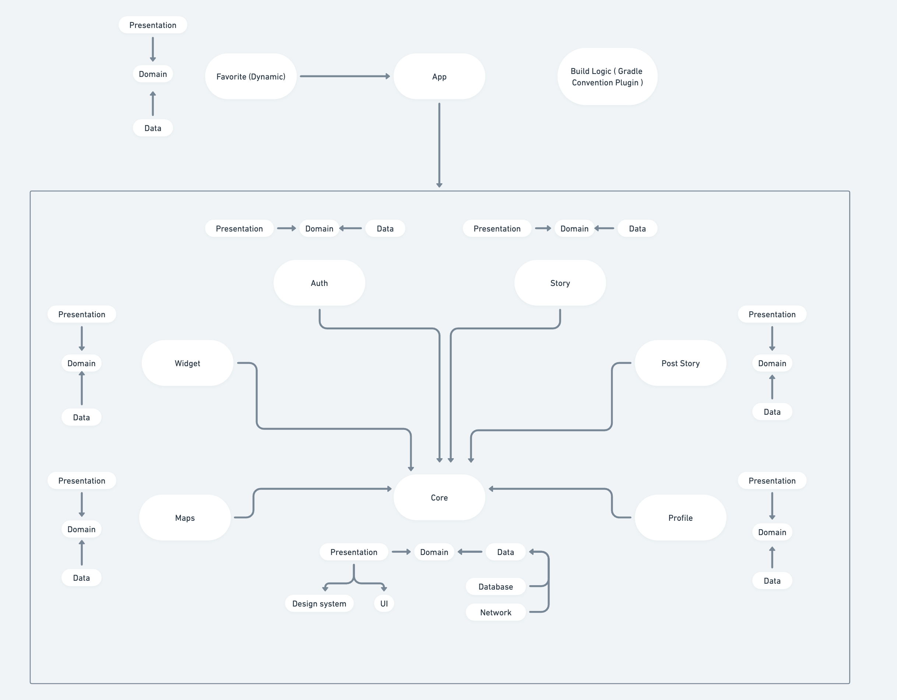

[](https://circleci.com/gh/galahseno/StoryAct)

## StoryAct

The goal of this project is as a final submission for an Android expert class
in [Dicoding](https://www.dicoding.com) and as a personal portfolio in a mobile application

disclaimer: Only use this project as reference, don't copy paste code for your submission
in [Android Expert Class](https://www.dicoding.com/academies/165)

## Screen Shots

<table style="padding:10px">
  <tr>
    <td></td>
    <td></td>
    <td></td>
  </tr>
  <tr>
    <td></td>
    <td></td>
    <td></td>
  </tr>
</table>

## Clean architecture with 3 main modules

- Data (for database, API and preferences code)
- Domain (for business logic and models)
- Presentation (for UI logic, with MVI)




## Tests

- [Mockk](https://mockk.io/) library
- [JUnit5](https://junit.org/junit5/) library
- [Turbine](https://github.com/cashapp/turbine) library (for kotlin flow test)
- Unit tests
    - test isolation class
- Integration tests
    - test class interaction with each other
- Activity tests (with [Compose Testing](https://developer.android.com/jetpack/compose/testing))
    - Coming Soon

## Other useful features

- This project use [Modularization](https://developer.android.com/topic/modularization)
- Favorite Feature
  with [Dynamic Feature](https://developer.android.com/guide/playcore/feature-delivery)
- Widget with [Jetpack Glance](https://developer.android.com/develop/ui/compose/glance)
- Version Management (
  with [Version catalog](https://docs.gradle.org/current/userguide/platforms.html))
- Shared Plugin Logic (
  with [Convention plugins](https://docs.gradle.org/current/userguide/writing_plugins.html#convention_plugins))
- Dependency injection (with [Koin](https://insert-koin.io/))
- Network calls (with [Ktor](https://ktor.io/docs/http-client-engines.html#minimal-version))
- Reactive programming (
  with [Kotlin Flows](https://kotlinlang.org/docs/reference/coroutines/flow.html))
- Android architecture components (Jetpack Library)
- Support Multi language (indonesia, engglish, jawa)
- [Splash Screen](https://developer.android.com/develop/ui/views/launch/splash-screen) Support
- Google [Material Design](https://material.io/blog/android-material-theme-color) library
- Declarative UI (with [Jetpack Compose](https://developer.android.com/jetpack/compose))
    - Compose Navigation (
      with [Koin Support](https://insert-koin.io/docs/quickstart/android-compose/) and Assisted
      Inject)
- Edge To Edge Configuration
- Paging 3
- Support Dark and Light Mode
- CI/CD with CircleCI
- Security
    - Encrypted Shared Preferences
    - Encrypted Database
    - Certificate Pinning
    - Obfuscation with ProGuard R8

# Getting started

1. Download or Clone this repository extract and open folder on Android Studio
   ```sh
   https://github.com/galahseno/StoryAct.git
3. Add baseUrl and Maps Api Key in local.properties
   ```sh
   BASE_URL=https://story-api.dicoding.dev/v1
   MAPS_API_KEY=<Your-Maps-Api-Key>
5. Run Projects